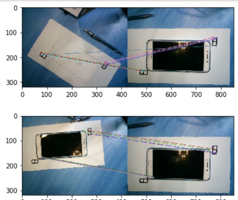
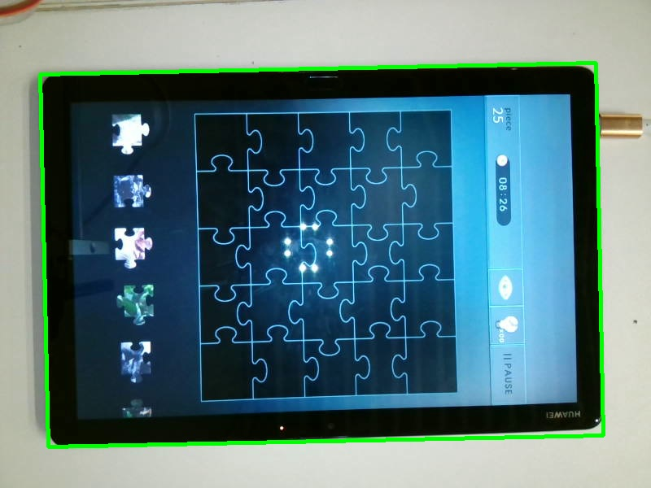
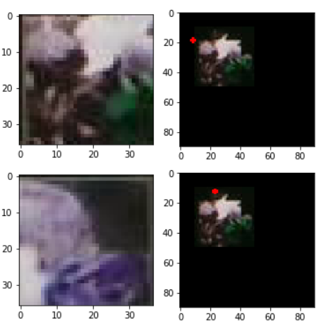
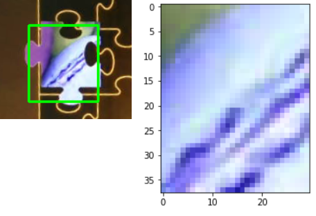
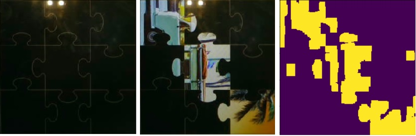
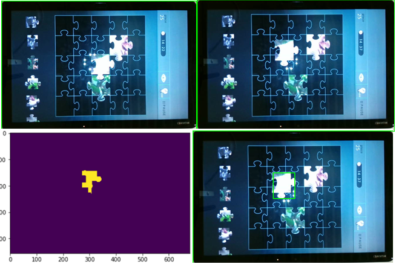
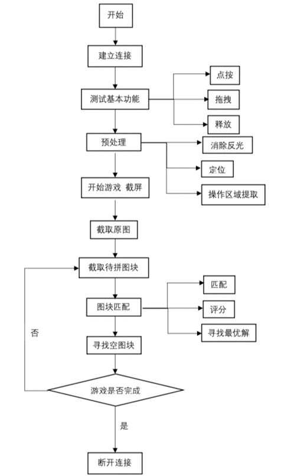

# JagsawCambot
A course project for SJTU EE356. Using a robot to play Jagsaw puzzle on a phone, via camera

CyberDIP driver for windows in C++ 11.
**Original project** [qtCyberDip](https://github.com/LostXine/qtCyberDIP)

任务是通过摄像头观察平板屏幕，然后计算，控制机械臂，玩拼图。

**虽然原作业要求说：**

>参加“数字图像处理基础”的同学，注意:\
>为了方便代码评阅，建议只修改 [usrGameController.h](./qtCyberDip/usrGameController.h) 和 [usrGameController.cpp](./qtCyberDip/usrGameController.cpp) 两个文件，最后使用git提交代码。

但是由于整个QT程序的逻辑是事件驱动，usrGameController里面定义的函数processing在每一帧摄像机输入图片都被调用一遍，所以难以实现自己玩游戏的逻辑。或者说要实现机器人自己玩游戏的主动动作，只改这两个文件基本是不可能的。同时为了方便开发，我们改了[qtcyberdip.h](/qtCyberDip/qtcyberdip.h) 和 [qtcyberdip.cpp](./qtCyberDip/qtcyberdip.cpp) 两个文件.增加了简单的UDPserver功能，这样使用python就可以轻松和机器人交互。

## 目录结构
- [qtCyberDip](./qtCyberDip)
  - 原来的qtCyberDip实现加了一个upd接口
    - 在[qtcyberdip](qtCyberDip\qtcyberdip.h#L92)增加了readyRead事件, 和一些相关的QTobject的定义
    - 在[usrGameController](qtCyberDip\usrGameController.h#L38)增加了保存最新的图片的功能，并且可以在返回给server
- [qtCyberCtl](./qtCyberCtl)
  - [CyClient](pyCyberCtl\CyClient.py)udp接口client端的实现
  - [cut](pyCyberCtl\Cut.py) 一开始截取平板位置的实现
  - [matchUtil](pyCyberCtl\matchUtil.py) 截取目标区域，模板区域，以及匹配算法，empty算法等等的实现
  - [player](pyCyberCtl\player.py)玩游戏的各种动作，初始化，过关等等的实现
  - [rawProcessing](pyCyberCtl\rawProcessing.py)失败的平板定位实现

## 课程实践内容

要完成本次可能实践的内容，主要有三个方面的问题需要研究解决，一个是控制整个机器人寻找位置，落笔，移动的完整体系，解决“动”的问题；第二个是针对输入图像的定位，矫正，增强等等预处理，解决“看”的问题；最后一个是图像的匹配以及寻找可行位置等等高级功能，解决“找”的问题。下面将详述我们在这三个方面做过的尝试以及最后的方案。

### 机器人移动框架

#### pyCyberCtl架构

我们的机器人移动框架是一个分层的结构，底层是基于qtCyberDIP改写的udp 服务器，上层是使用python实现的控制算法，名叫pyCyberCtl。两层之间使用udp进行指令和数据的传输。支持的指令有：1. 一个简单检查通信的“say hello”指令; 2. 一个返回触控笔当前位置的指令。3. 一个执行移动笔，抬起放下点击笔操作的指令; 4. 一个返回当前摄像头图片的指令。有了底层这稳定可靠的四个指令，上层可以轻松高效地使用python尝试新的算法，使用Jupiter
notebook单步试验新的运动逻辑。

#### 机械臂与平板的定位操作

本次课程实践中，我们没有做闭环的机械臂位置矫正，所以需要在实验准备时人工调整机械臂和平板的位置使得每次机械臂可以点在正确的地方

### 平板定位与截取

#### 平板定位

平板定位的意义是不需要每次严格调整摄像头和平板的相对位置，而是自动确定平板位置，截取有意义的图像信息。我们总过尝试过两种方法。

**第一种方法**，通过在目标附近的固定位置放置一些特征，比如用笔做一些标记，每次定位平板的时候用之类的算法匹配标准位置时的特征点以及当前图像的特征点。如图。然后由于这些匹配的目标点可以视为是由一个仿射矩阵从当前图像转移到目标图像的，我们可以求解这个仿射矩阵（可以推出使误差最小的显式解）。再将整个当前图片采取同样的变化变化到目标图片，从目标图片中截取固定位置。

这种定位方法的好处是可以处理角度带来的畸变问题，另外好处是摄像头的任何角度，理论上都可以截取出我们需要的屏幕位置。但是，在实践中，由于sift算法中一些点会匹配错误，（一些点错误的问题可以使用bootstrap的方式找到最相近的一群匹配点，忽略噪声匹配点，但是加上了这样的补救措施之后仍不如第二种方法稳定）（以及测试时过于自信故意刁难算法）导致算法的精度并不好。

**第二种方法**，不使用平板周围的特殊标记，而直接讲平板放置在一个纯白的背景上，直接利用平板的形状特性，做一些平滑和梯度处理后截取矩形区域（cv2. findContours）。如图 2

这种方法虽然对人为确定的环境要求更高，需要保证图片尽量没有畸变，以及旋转角度不能超过九十度，以及平板附近没有过分的阴影导致轮廓位置的偏差。但是总体而言更加稳定。所以我们最后使用的是这种算法。

#### 目标区域，原图，候选模板区域定位

能精确地定位平板的区域之后，我们可以通过简单的比例截取得到目标区域，原图和候选图片区域

#### 模板定位

在定位了整个的候选模板区域之后，我们还需要定位单个模板。定位单个模板的思路和前述的定位类似，也是高斯平滑加阈值分割寻找矩形轮廓。如图 3

#### 色彩直方图均衡

由于有的时候光线变化，为了突出不同块之间的分别，我们尝试了色彩直方图均衡，也就是在每一个颜色通道上面应用`equalizeHist`。但是实际使用效果不好。

 ### 模板匹配与游戏流程

模板匹配的任务是匹配候选区域的模板和原图，寻找最合适的原图区域。我们有两个渐进的模板匹配算法，第一个是模板还在候选区域，此时模板很小而且截取模板位置很可能不精准，所以第一次模板匹配的意义主要是为了找到模板的位置然后把它放到场上。模板放到目标区域之后会放大，并且由于我们将模板移动到了一个确定的位置，我们可以精确地截取模板区域了。所以此时使用第二个模板匹配算法，使用更加精确的模板，确定下一次的位置。

由于模板匹配算法可能有各种各样的原因失效（比如摄像头的灯光），所以我们加入了试错机制，利用拼图游戏如果成功拼到位置，拼图快就会吸附在正确位置上的特性，我们可以在每次尝试了新位置之后，拖动拼图块，如果拼图没有移动，则说明这个是正确的位置。这样的试错机制建立在一个判断区域是否为空的基础上，我们后面称之为判断empty，这个函数返回每一个位置当前是否有拼图块。

#### 首次模板匹配

首次模板匹配的任务是从候选区域找到模板，然后将模板放到入场位置中。我们经过一些尝试，发现首次模板匹配时，由于截取的模板黑色区域较多，所以使用原图作为模板，在模板上面滑动得到匹配的效果会比正常的模板在原图上面滑动要好。因此，我们的首次模板匹配的第一步是把原图切分成N*N个区域，每个区域的中心在模板上面滑动。如图 4。然后比较每一个区域的最大值，最大的即为匹配到的结果模板

图 4中红点的位置就是匹配的最大值的位置，有时，由于目标图片中的黑色背景与模板图片边缘的黑色相似，在一次滑动之后上面的匹配最大值相似度并没有形如下面的匹配最大值相似度高。为此，我们加了两个修正。

**第一个**是利用匹配到的点的位置，因为如果是正确的匹配的话，匹配到的点应该

在图片的左上角（如图 4上面的匹配）。这是因为，如果把相似度用概率来表示的话有: $P(x,y,I,T) = P(x,y)*P(I,T|x,y)$，其中x,y是模板在目标图像中的相对位置，I,T分别是目标图像和模板图像。等式左边的意思是在x,y这个位置I,T两张图片匹配的概率。等式右边的第二项是在这个位置的相似度，也就是用`cv. matchTemplate `计算出来的数值。第一项是匹配位置应该是这里的概率，最理想的状态应该是0,0，因为此时切割出的模板正好在模板的边缘，但是实际中由于各种误差，切割的模板原点会有偏移，我们假设偏移服从一个高斯分布，即P(x,y)。所以在实际实现时，由于一般距离等等相似度的意义是”log likelihood”（也是假设了二者成高斯分布之后推出log likelihood），所以我们只需在`cv. matchTemplate`的基础上加一个最高点为0,0的高斯分布即可。

**第二个**是直接利用mask降低黑色区域对结果的影响，这一点可以通过`cv.matchTemplate`里面的mask参数来实现，但是由于支持mask的匹配方法只有TM_SQDIFF或者TM_SQCCORR，但是实际实验中使用了TM_CCOEFF_NORMED的效果比其余二者加了mask还要好。所以最后这个修正没有使用

#### 精确模板匹配

在将模板移动到一个我们指定的位置之后，我们可以截出一个没有背景黑色区域的模板进行匹配，如图 5，匹配的算法仍然基于`cv. matchTemplate`。

之所以要使用如此小的一个区域来匹配，是因为经过大量实验我们发现，导致匹配失效的罪魁祸首就是拼图块周围的黑色，所以与其以引入黑色干扰的代价找更大的匹配区域，还不如直接寻找一个确保没有黑色干扰的模板。

精确模板匹配没有使用前面说过的奇技淫巧，因为效果已经足够好了.

#### empty判断

Empty返回一个$N*N$的布尔矩阵，用来判断相应的位置是不是空的。empty的意义在于，有了empty就可以使用排除法，排除已经放对位置的模板，以及使用验证一个模板是否放对了位置。我们empty尝试了两种方法。

**第一种**是找一个已知完全empty的图片，和当前图片做差，然后经过阈值和形态学处理消除噪声，得到一个二值图，如图 6，统计N*N的每一个小块中为1的值，如果超过了一个阈值，则视为不empty（其实还尝试过使用opencv自带的`BackgroundSubtractor`，但是由于我们最后整个背景都会被填满，所以`BackgroundSubtractor`并不适用于这个任务）

但是第一种方法的好处是基于做差，所以理论上更能适合不同的环境条件。比如上图中摄像头的灯导致的亮点就可以被做差消除。基于做差也可以更加大胆地设定阈值，这样确保较暗的模板放在区域中也能被发现。但是这样的做差处理在实际使用中效果很糟，走不了几步就出现全局都不empty的情况，究其原因是因为摄像头会在笔移来移去的时候变焦，会随着目标区域中放的模板越来越多而调整颜色，因此导致全局有很大的差值。

**第二种**是放弃做差，直接用灰度阈值，其它的和第一种方法一样。使用的阈值比较保守，为了使用形态学操作消除摄像头灯的亮点，所以形态学操作比较激进。这样的问题是可能无法检测到比较黑的图片。但是由于第一种方法的致命问题，我们在实际使用中采取第二种方法。

### 游戏流程优化

有了前面的“看”，“动”，和“找”。我们已经可以完成一次游戏流程了。但是我们在实际测试的时候发现有时在机器人拖动拼图块的过程中拼图块可能“脱钩”。也就是在起始点和中点中间脱离触控笔的控制而停留。为了应对这种情况，我们还做了“脱钩”检测算法。

“脱钩”检测的基本思路类似于第二种empty判断。使用同样的阈值和形态学处理。对移动前和移动后的观察到的图片分别做阈值分割和形态学处理得到二值图像，在二值图像上用后面的图片减去前面的图片。然后再寻找方形轮廓即可。过程如

## 研究成果

有了前述的结构和算法描述，下面图 8是我们的游戏流程图

经过测试，我们通过了很多平板上5*5的拼图游戏

## 研究总结

我在这次课程实践中受益匪浅。原本，在和队友讨论决定做拼图的时候，我认为这是一个蛮简单的任务，甚至在第一周，用两天时间，从完全不会QT和udp到开发出一个稳定的udp接口，从而把后面的工作都迁移到python上，我还以为我已经完成了这个工程中最困难最重要的一步。但是后面图像处理的各种意外出乎我的想象，通过这次课程实践，我算是深切体会到了理论和实际工程的区别。

可以从第二部分中看到我们对于很多功能都给出了两种实现和尝试，比如平板定位算法使用sift匹配特征点求解仿射变换方程vs.直接做阈值处理然后选出矩形，比如模板定位的颠倒模板和图像关系加高斯vs.直接选一个小一点不带黑色的模板，比如empty做差再过阈值和形态学vs.直接阈值形态学。这些尝试中，前面花绿呼哨的是我的，后面看似平平无奇，直来直去的是我队友的，而整个游戏过程中实际发挥作用的，正是这些看似简单的算法，而前面又是解方程又是推概率公式的，效果都不好。

这一点算是对我的一个教训，我平时接受的教育和训练中，有理论基础的东西为上品，甚至感觉如果不对问题进行一次抽象，一次建模，这样解决出来的问题只是打补丁一样的不系统，不全面。但是，这次课程实践，在一次次地奇怪为什么解出来地仿射方程老是歪的时，在最后惊讶于队友把模板缩小一点就带来了匹配精度的飞跃时，我意识到不管方法帅不帅，能解决问题才是王道。

另外还有一点花绿胡绍是，我当时认为如果没有一个可以从C++中解放出来的udp接口，那么后续开发过程中的大部分精力都会费在C++的泥潭中，处理异步的问题，摄像头传来的中断的问题，内存释放的问题。我认为我设计的游戏过程完美无缺，一开始找到模板以及初次匹配，然后模板上场之后可以再次得到更加精确的模板图，后面还能利用empty进行试错。Empty也有出错的可能，所以我还增加了trustworthy（其实就是对空图片的empty）。这样多种方法结合，允许一些方法出错，但是保证整体的鲁棒和稳定。如果没有试错的话，光靠保证模板匹配百分百正确率未免太草率了。但是，当我听说另一组没有udp接口分层，没有试错机制，但是还能完成4*6的拼图的时候，我惊呆了。目前我还没仔细研究他们的实现方式，但是他们的成功让我反思我是不是设计解决方案的思路有问题。

总之，这次课程实践中，我不仅仅锻炼了实际上手搭建框架以及处理图片的能力，更重要的是引起了我的反思，一个有关解决问题的方法论的哲学层面的问题，我受益匪浅。